# Geometries
{: .no_toc }

This page explains how the geometries referenced by a `Blender Object` are exported to FDS *geometric* namelists.
{: .fs-6 .fw-300 }

## Table of contents
{: .no_toc .text-delta }

1. TOC
{:toc}

---

## The Blender Object and its shape

Each `Blender Object` represents a geometric entity in the `Blender Scene` domain.

While the object data-block acts as a local reference system and contains the item *location*, *rotation*, and *scale*, the object shape is described by a related `Blender Mesh` data-block. The mesh is a collection of connected *vertices*, *edges*, and *faces*.

See the FIXME wiki page for a description of the Blender data-blocks and how they are exported/imported to the FDS case.

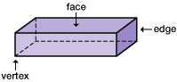

## The traditional FDS geometric namelists

Some *geometric* FDS namelists extend their effects to volumes, planes, faces, segments, or points in the FDS domain. For example, this namelist generates a box-shaped obstacle to the fluid:

```fortran
&OBST ID='Example obstacle' XB=-1.0,1.0,-1.0,1.0,-1.0,1.0, /
```

See the [FDS User's Guide](https://pages.nist.gov/fds-smv/manuals.html) for further details.

The more common geometric FDS namelists are: `DEVC`, `HOLE`, `HVAC`, `INIT`, `MESH`, `OBST`, `PROF`, `SLCF`, `VENT`, and `ZONE`. Those namelists always require one or more of the following geometric parameters: `XB`, `XYZ`, or `PB*` (that is `PBX`, `PBY`, or `PBZ`).

BlenderFDS manages those geometric parameters, and takes care of exporting/importing them to FDS as shown in the following paragraphs.

### The `XB` parameter

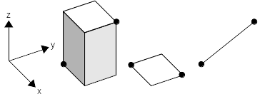

In FDS, the `XB` parameter is able to represent a parallelepiped parallel to the reference axis, a flat face perpendicular to one of the reference axis, or any segment in space. BlenderFDS proposes several different
choices for exporting object shapes to the `XB` parameter.

| `XB`  | Exported as | Example |
| :---: | :--- | :---: |
| `BBox`   | One namelist, a parallelepiped corresponding to the bounding box of the shape | 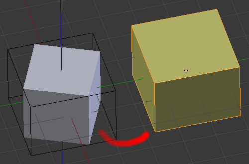 |
| `Voxels` | Many namelists, stair-stepping approximation of the shape volume | 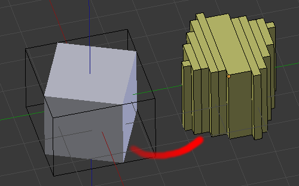 |
| `Faces`  | Many namelists, one per face of the shape, set parallel to reference planes | 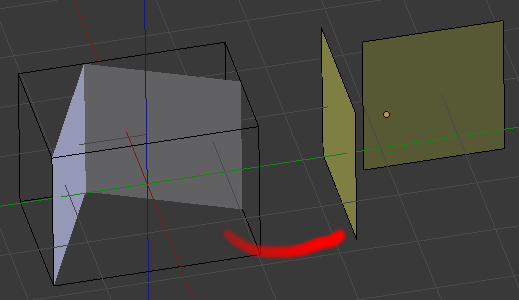 
| `Edges`  | Many namelists, original shape edges. | 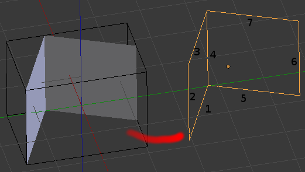 |

When stair-stepping the shape volume, the size of the voxel is taken from the `Voxel/Pixel Size` setting on the `FDS Case Config` panel.

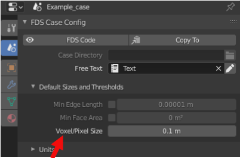

The resolution can be also customized for each object by filling the appropriate setting under the `XB` label.

The `Center Voxels/Pixels` setting centers the stair-stepping algorithm to the object, instead of the default alignment with other objects voxels.
The default alignment prevents the formation of holes between the stair-stepped shapes.
The voxel centering improves the fidelity of the stair-stepped geometry to the original shape, eg for creating a symmetric stair-stepped sphere.

The `IDs suffix` setting adds different kinds of suffixes to the object `ID` parameter, when generating multiple namelists from the same object.

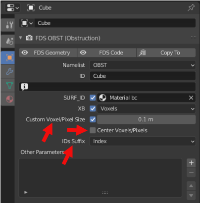


### The `XYZ` parameter

In FDS, the `XB` parameter is able to represent a point in space. BlenderFDS proposes two different
choices for exporting object shapes to the `XYZ` parameter.

| `XYZ` | Exported as | Example |
| :---: | :--- | :---: |
| `Vertices` | Many namelists, one per shape vertex | 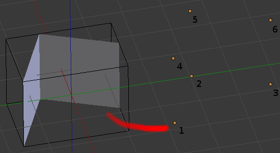 |
| `Center`   | One namelist, center point of the object | None |

For example, if you wish to create a line of thermocouples:
add a new an object, set its namelist to `DEVC` and `XB` parameter to `Vertices`.
Then create the vertices in the appropriate locations.

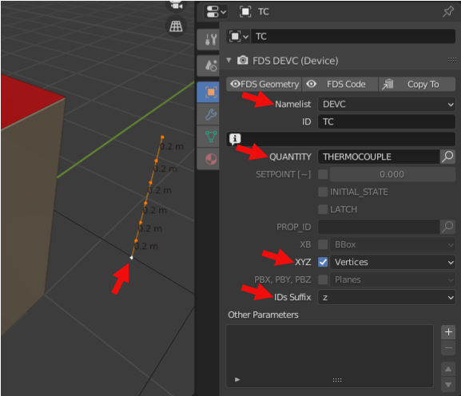

By setting the `IDs Suffix` to `z` you obtain these `DEVC` namelists with nice `ID` parameters:

```fortran
! XYZ Vertices: 7
&DEVC ID='TC_z+0.500' XYZ=1.500000,1.500000,0.500000 QUANTITY='THERMOCOUPLE' /
&DEVC ID='TC_z+0.700' XYZ=1.500000,1.500000,0.700000 QUANTITY='THERMOCOUPLE' /
&DEVC ID='TC_z+0.900' XYZ=1.500000,1.500000,0.900000 QUANTITY='THERMOCOUPLE' /
```

### The `PBX`, `PBY`, and `PBZ` parameters

In FDS, the `PB*` parameters are able to represent a plane perpendicular to one of the reference axis. BlenderFDS proposes one way of exporting object shapes to the `PB*` parameters.

| `PB*` | Exported as | Example |
| :---: | :--- | :---: |
| `Planes` | Many namelists, one per face of the shape, set parallel to reference planes |  |

For example, if you need to generate several `SLCF` slice files: add a new an object,
set its namelist to `SLCF` and `PB*` parameter to `Planes`.
The faces you create in the object are transformed into planes, parallel to reference planes.

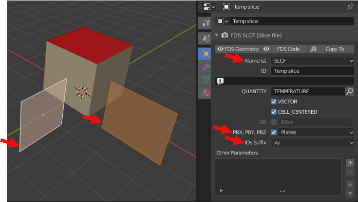

Here are the `SLCF` namelists you obtain:

```fortran
! PB* Planes: 2
&SLCF ID='Temp slice_x+0.000' PBX=0.000000 QUANTITY='TEMPERATURE' VECTOR=T CELL_CENTERED=T /
&SLCF ID='Temp slice_y-0.000' PBY=-0.000000 QUANTITY='TEMPERATURE' VECTOR=T CELL_CENTERED=T /
```

## The `GEOM` namelist

Recent FDS versions propose an additional geometric namelist named `GEOM`. This namelist extends the traditional `OBST` box-shaped obstacle to a generic-shaped obstacle in the fluid domain. The `GEOM` namelist requires other geometric parameters as `VERTS`, `FACES`, `VOLUS`, or the reference to an external `.bingeom` binary file called from the `BINGEOM_FILE` parameter.

For example:

```fortran
&GEOM ID='Example' SURF_ID='S1','S2',...
      VERTS=-1.0,1.0,-1.0,... FACES=1,2,1,1,...
      /
&GEOM ID='Example' SURF_ID='S1','S2',...
      BINGEOM_FILE='~/example.bingeom'
      /
```

BlenderFDS can export/import both formats.

As already said, the shape of a Blender Object is made of vertices, edges, and faces. It is exactly the same representation used by the `GEOM` namelist in FDS. So the shapes of the objects can be exported/imported without modification.

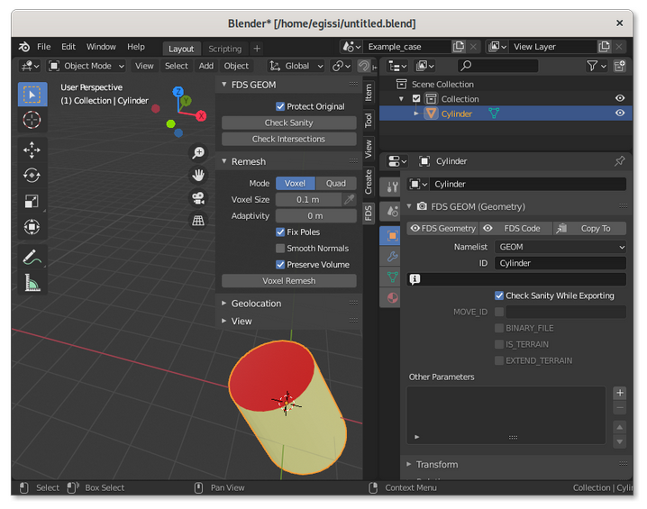

### The `GEOM` properties panel

The `GEOM` properties panel has several settings.

FDS has strict requirements on the quality of the triangulated surface of `GEOM` namelists. When representing a solid obstacle in space, the surface shall be [manifold](https://sinestesia.co/blog/tutorials/non-manifold-meshes-and-how-to-fix-them/) and closed. So BlenderFDS performs a series of automatic sanity checks while exporting. If they are too intrusive for your use case, these checks can be disabled by toggling the `Check Sanity While Exporting` parameter.

If you want to add a `MOVE` namelist to explicitely write the *rotation*, *location*, and *scale* applied to the `GEOM` namelist shape, you can set the `MOVE_ID` toggle and also provide an optional name for the transformation. 

If you want to export the binary format of the `GEOM` namelist, set the `BINARY_FILE` parameter. You can optionally select the path and filename of the `.bingeom` file that is going to be created upon export. The default filename is taken from the `Blender Mesh` name, that contains the shape of the object and can be shared between several object instances (eg. several identical chairs around a table, sharing the same `Blender Mesh` shape). If the same shape is shared by several `GEOM` instances, one only common `.bingeom` file is exported.

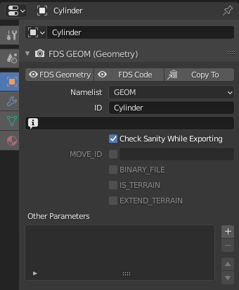

By setting the `IS_TERRAIN` toggle, the `GEOM` namelist can also be used to describe vast terrains, eg. for wildfire or smoke dispersion of fire pollutants simulations. In this case the `GEOM` namelist may only describe the surface of the terrain, there is no need to create the solid ground beneath it. 

If the terrain geometry does not completely cover the calculation domain, set the `EXTEND_TERRAIN` toggle, and FDS will extend the surface to the entire domain. 


Another companion tool for terrains is [qgis2fds](https://github.com/firetools/qgis2fds/wiki),
an open [QGIS](http://www.qgis.org) plugin that exports terrains and landuse from geographical data
for wildfire simulation and atmospheric dispersion of fire pollutants.
The FDS file generated by qgis2fds can be imported to BlenderFDS for further customization.

### The `GEOM` tool sidebar

The `GEOM` sidebar offers several tools for checking and fixing the triangulated surfaces,
before exporting them to FDS.

When the `3D Viewport` editor is in `Object Mode`:

 * if you click on the `Check Sanity` button, the selected object triangulated surface is checked for [manifoldness](https://sinestesia.co/blog/tutorials/non-manifold-meshes-and-how-to-fix-them/);

 * clicking on the `Check Intersections` button, you verify the existance of intersections between the [current active object and all the selected objects](https://docs.blender.org/manual/en/latest/scene_layout/object/selecting.html) geometries;

 * if you untoggle the `Protect Original` setting, when checking geometry sanity or intersections BlenderFDS selects the offending elements in the `3D Viewport` after changing the editor mode to `Edit Mode`. Note that in this case the checked geometry has to be triangulated, thus modified from the original state.

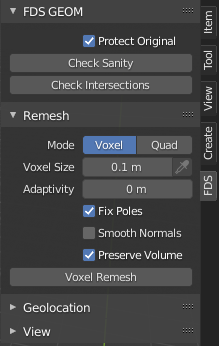

When the `3D Viewport` editor is in `Edit Mode`, a `Clean Up` panel is shown, where [selection tools](https://docs.blender.org/manual/en/latest/modeling/meshes/selecting/all_by_trait.html) and [cleanup tools](https://docs.blender.org/manual/en/latest/modeling/meshes/editing/mesh/cleanup.html) are offered. 

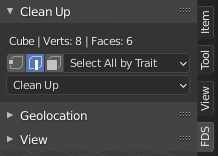

### Remeshing panel

Remeshing is a technique that automatically rebuilds the geometry with a more uniform topology, and is often used to fix bad geometries by generating a new manifold mesh from the current geometry. It produces a mesh with perfectly even distributed topology.

The BlenderFDS `Remesh` panel is a convenience copy of the same panel used in Blender in `Sculpting Mode`. Read its documentation [here](https://docs.blender.org/manual/en/latest/sculpt_paint/sculpting/tool_settings/remesh.html).

See also the Blender `Remesh Modifier` for a different approach to the same technique, [here](https://docs.blender.org/manual/en/latest/modeling/modifiers/generate/remesh.html) is its documentation.

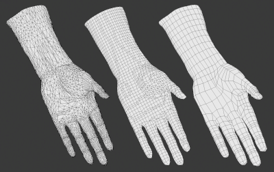
