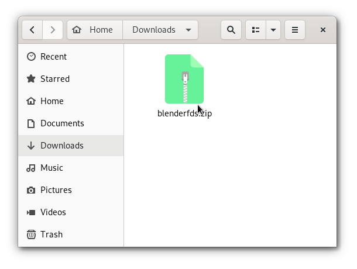
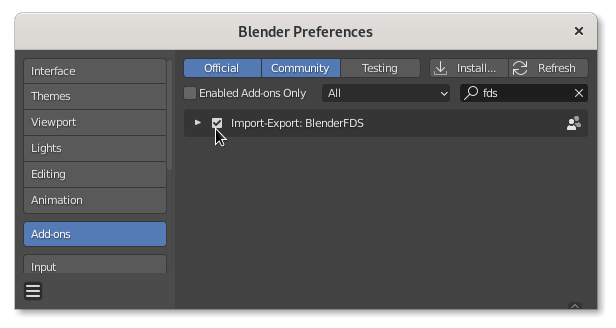
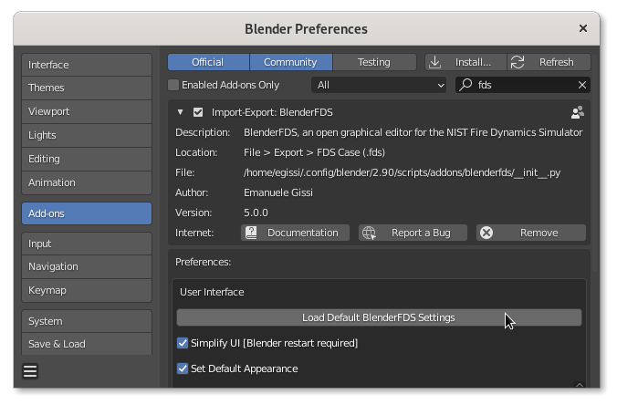
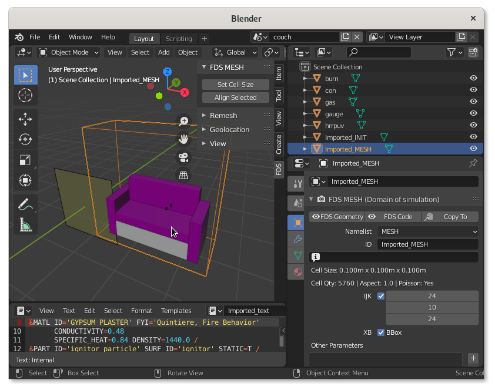

# Install
{: .no_toc }

This page describes how to set up your BlenderFDS installation as a Blender addon.
{: .fs-6 .fw-300 }

## Table of contents
{: .no_toc .text-delta }

1. TOC
{:toc}

---

## Requirements

First, install the [Blender application](https://www.blender.org/) on your computer,
as explained in the relevant [Blender documentation](https://docs.blender.org/manual/en/latest/getting_started/install/index.html).

Take a look at the [software requirements](Software-requirements) page for required software versions.

## Install a *stable* version

Being so specific in scope, the BlenderFDS addon is not distributed with Blender.
To begin using this plugin, you need to download, install, and enable the latest released version as follows.

### Step 1: Download the plugin

Go to the [release page](https://github.com/firetools/blenderfds/releases)
and click on the `blenderfds.zip` package of the latest release.

The release zipped file is downloaded to your computer.



### Step 2: Install and enable the addon

To install the just downloaded release:

 * launch Blender;
 * open the `Preferences` panel by clicking on the `Edit > Preferences` menu;
 * select the `Add-ons` section in the `Preferences` panel;
 * click on the `Install` button and use the file browser to select the `blenderfds.zip` you downloaded in the previous step;
 * enable the BlenderFDS addon by checking the box to the left;



The BlenderFDS functionality should become immediately available.

If the addon does not activate, check the console window for any errors that may have occurred.
In this case, please file an issue on the [issue tracker](https://github.com/firetools/blenderfds/issues).

### Step 3: Post install setup

By clicking on the arrow at the left of the addon in the `Preferences > Add-ons` panel, you can see the relevant information and links. In the same section, you find the BlenderFDS [preferences]().

Click on the `Load Default BlenderFDS Settings` button to complete the setup.



## Install a *live* development version

If you want to stay on the edge of development to test brand new features, instead of installing a stable version, you can clone the `firetools/blenderfds` repository to your local Blender addons folder. Beware that you need to be Git savvy to install a *live* development version.

### Step 1: Find the right location

[This Blender documentation page](https://docs.blender.org/manual/en/latest/advanced/blender_directory_layout.html)
specifies the default directories for Blender application and settings, depending on the operating system.

For example, the user's addons are currently stored in:

 * on Linux: `$HOME/.config/blender/2.92/script/addons/` (in my case the `$HOME` variable contains the `/home/egissi/` directory)
 * on macOS: `/Users/$USER/Library/Application Support/Blender/2.92/script/addons/` 
 * on Windows: `%USERPROFILE%\AppData\Roaming\Blender Foundation\Blender\2.92\script\addons\` 

This `addons` directory is the right location for the clone of the `firetools/blenderfds` repository.

Note that, if installing the first addon yourself, you may need to create the `addons` directory and its tree.

### Step 2: Clone the repo and enable the addon

Next, with the `Git` tool already installed, get into your `addons` directory and clone the `blenderfds` repository as follows:
```
$ cd ~/Library/ApplicationSupport/Blender/2.90/scripts/addons/
$ git clone git@github.com:firetools/blenderfds.git
```

To enable the just cloned addon:

 * launch Blender;
 * open the `Preferences` panel by clicking on the `Edit > Preferences` menu;
 * select the `Add-ons` section in the `Preferences` panel;
 * search and enable the BlenderFDS addon by checking the box to the right;


The BlenderFDS functionality should become immediately available.

If the addon does not activate, check the console window for any errors that may have occurred. In this case, please file an issue on the [issue tracker](https://github.com/firetools/blenderfds/issues).


### Step 3: Post install setup

Do what is described in step 3 of the previous paragraph to setup the addon.



