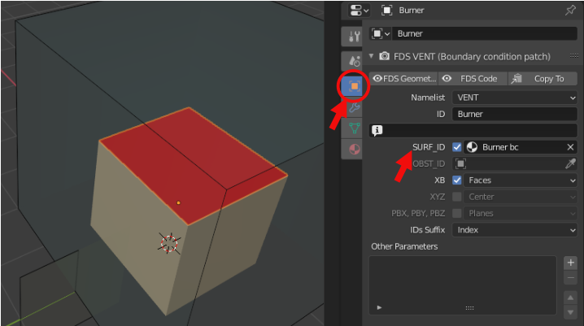
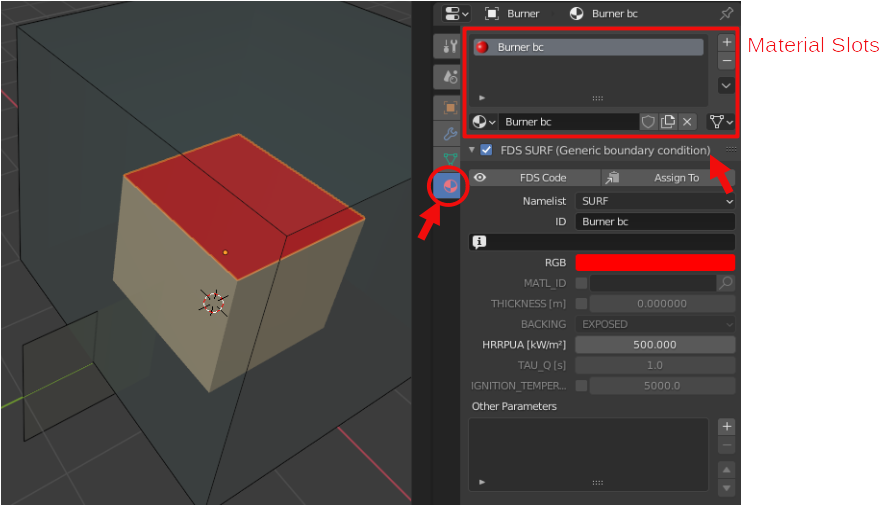
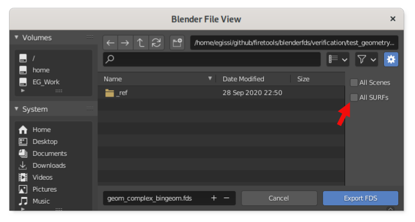
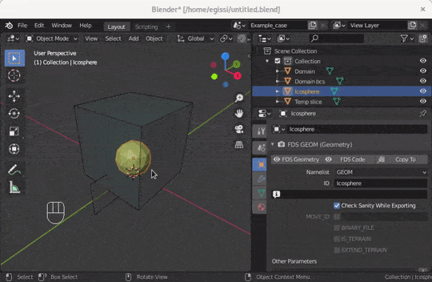

# Set FDS boundary conditions
{: .no_toc }

This page explains how to set and link boundary conditions to the object geometries
{: .fs-6 .fw-300 }

## Table of contents
{: .no_toc .text-delta }

1. TOC
{:toc}

---

## The Blender Object and its Material data-blocks

`Blender Material` data-blocks controls the appearance of a `Blender Object`:
its color, texture, and how the light interacts with it.
The shape of each object can be decorated by one or more materials.
At the very top of the `Material` tab of the `Properties` panel, you find the material slots,
the list of all the materials that are referenced by the object
and can be used to set the appearance of the shape faces.
When looking at the list of material slots, the currently selected slot sets the *active* material.

As with all Blender data-blocks, even `Blender Material` data-blocks can be shared
between objects and `.blend` files.

BlenderFDS uses those same materials to define the boundary conditions,
both exporting/importing the related `SURF` namelists,
and appling them to certain objects with the `SURF_ID` parameter.

## Setting the boundary condition of `OBST` and `VENT` namelists

In BlenderFDS, the *active* material of the object with `OBST` and `VENT` namelists
is exported as its `SURF_ID` boundary condition.



The `Material` tab of the `Properties` panel contains the parameters of the linked `SURF` namelists.



By default, the `SURF` namelist gets exported only when called by any of the exported objects.
Anyway, you can have all the `SURF` lines exported by selecting the `All SURFs` toggle
in the exporting panel opened by the `File > Export > NIST FDS` menu.



Here is an example of the exported FDS namelists:

```fortran
&SURF ID='Burner bc' RGB=255,0,0 HRRPUA=500.0 /
&VENT ID='Burner' SURF_ID='Burner bc' XB=-1.,1.,-1.,1.,1.,1. /
```

Conversely, the `SURF_IDS` and `SURF_ID6` parameters of the `OBST` namelist are not supported.
If you need to define different boundary conditions on the faces of an `OBST` parallelepiped,
add one or more `VENTs` over the appropriate faces, or use the new `GEOM` namelist.

## Setting the boundary conditions of `GEOM` namelists

The `GEOM` geometric namelist extends the traditional `OBST` box-shaped obstacle
to a generic-shaped obstacle in the fluid domain, as shown in the [Geometries wiki page](Geometries).

A different boundary condition can be assigned to each face of the triangulated surface.
The available boundary conditions are linked into the `GEOM` line by the `SURF_ID` parameter.
Then they are assigned to each face by an index in the `FACES` parameter.
See the [FDS User's Guide](https://pages.nist.gov/fds-smv/manuals.html) for further details.

BlenderFDS can export/import the index pointing to the right `SURF` namelist for each face.

In the case of `GEOMs`, you can add as many boundary conditions as you like to the object
by adding `Blender Material` data-blocks to its materials slots,
and assign those boundary conditions to each of the faces of the object shape.

The following screencast shows how to assign different boundary conditions to the faces of the object shape. 



Here is an example of the exported FDS namelists:

```fortran
&SURF ID='Burner bc' RGB=255,0,0 HRRPUA=500.0 /
&GEOM ID='Example' SURF_ID='INERT','Burner bc' VERTS=... FACES=... /
```
