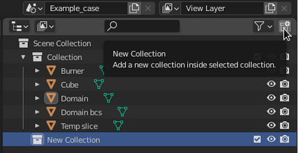
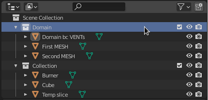
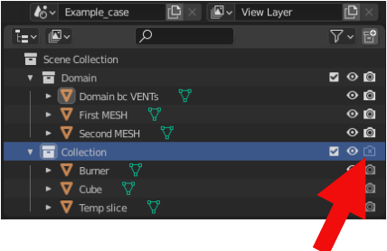
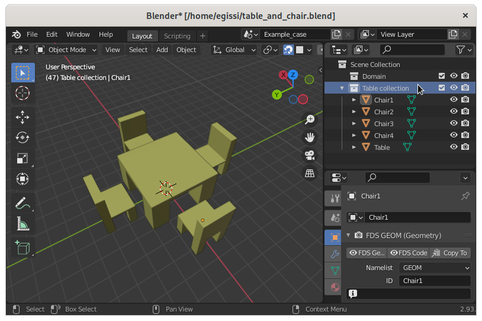
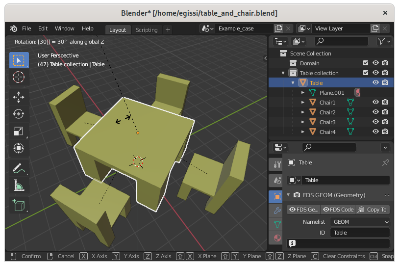

# Organize the FDS cases
{: .no_toc }

This page explains how to organize the namelists of your FDS case
{: .fs-6 .fw-300 }

---

## Table of contents
{: .no_toc .text-delta }

* TOC
{:toc}

---

## Overall order of the exported FDS namelist groups

A tipical FDS case consists of thousand of lines.
BlenderFDS generates a sorted list of FDS namelist groups from `Blender Scene`, `Object`, and `Material` entities.

The order of namelists in the exported FDS case file is the following:

| Order | Category | Example namelists | Exported From | Reference |
| :---: | :--- | :--- | :--- | :--- |
| 1 | General configuration | `HEAD`, `TIME`, `MISC`, `REAC`, ... | `Blender Scene` | See [link](../quickstart#blender-scene-tab) |
| 2 | Free text | Any namelist group | `Blender Text` | See [link](../quickstart#the-text-editor) |
| 3 | Boundary conditions | `SURF` | `Blender Material` | See [link](../quickstart#blender-material-tab) |
| 4 | Geometric entities  | `OBST`, `VENT`, `GEOM`, `SLCF`, `DEVC`, ... | `Blender Object` | See [link](../quickstart#blender-object-tab) |

Boundary conditions are sorted in alphabetic order by name, corresponding to their FDS `ID` parameter.

The geometric entities are grouped by `Blender Collection` and sorted in alphabetic order by name, corresponding to their FDS `ID` parameter.

## Order your geometric namelists with collections

There are always many `Blender Object` entities in a `Scene`, each of them representing one or more namelist groups.
In fact a typical FDS case consists of solid obstacles (eg. `OBST`, `GEOM`), their boundary condition patches (eg. `VENT`), many output quantities or control devices (eg. `SLCF`, `DEVC`, ...), and more.

`Blender Collection` entities help you keep everything organized by allowing you to group related geometric entities together.
Collections are used to just logically organize your case, or to facilitate one-step appending or linking between several Blender files or across scenes.

All you need to do to create a new collection is to right-click in Blender `Outliner` panel and select that top left button. Then drag your geometric entities in and out of your collection.



You can reorder the collections by dragging and dropping their names in the `Outliner` panel at the desired position.

For example, if you want to have all your `MESH` lines, and relative `VENT` boundary conditions, first in the FDS case file:

 * create a collection suitably named (eg. `Domain`),
 * put all your `MESH` and related `VENT` entities into the collection,
 * drop the created collection to the first position in the `Outliner` panel,
 
 as follows:



This example is exported with the `Domain` collection first, then the rest:

```fortran
! --- Geometric namelists from Blender Collection <Domain>
&VENT ID='Domain bc VENTs_0' PBX=... SURF_ID='OPEN' /
&VENT ID='Domain bc VENTs_1' PBX=... SURF_ID='OPEN' /
&VENT ID='Domain bc VENTs_2' PBY=... SURF_ID='OPEN' /
&VENT ID='Domain bc VENTs_3' PBY=... SURF_ID='OPEN' /
&VENT ID='Domain bc VENTs_4' PBZ=... SURF_ID='OPEN' /
&MESH ID='First MESH' IJK=20,20,20 XB=... /
&MESH ID='Second MESH' IJK=20,20,20 XB=... /
! --- Geometric namelists from Blender Collection <Collection>
&VENT ID='Burner' SURF_ID='Burner bc' XB=... /
&OBST ID='Cube' SURF_ID='Material bc' XB=... /
&SLCF ID='Temp slice' QUANTITY='TEMPERATURE' PBX=... /
```

You can even disable an entire collection from being exported to the FDS case by clicking on the `Disable in Renders` button.



See [this page](https://docs.blender.org/manual/en/latest/scene_layout/collections/collections.html) of the Blender Manual for a reference on collections. 

## Parenting geometric entities

When modeling a compound object, such a table and its chairs, you may choose to model the different parts as separate objects. However, all of the parts may be related to each other. In these cases, you want to designate one object (eg. the table) as the parent of all the children (eg. the chairs). Movement, rotation or scaling of the parent also affects the children.

Unlike collections, parenting objects groups them together with a *transformation relationship*.

Here is the example of the table and its chairs objects, grouped in a `Table collection` before parenting:



To parent the chairs to the table, drag and drop each chair over the table name in the `Outliner` panel while pressing the `Shift` key.
After parenting, if you rotate the table, the chairs are rotated accordingly:



See [this page](https://docs.blender.org/manual/en/2.93/scene_layout/object/editing/parent.html) of the Blender Manual for a reference on parenting geometric entities.

## Set FDS case variations with view layers

TODO

## Set many related FDS cases with scenes

TODO

## Share entities between projects with linked libraries

TODO

