# Quickstart
{: .no_toc }

This page guides the new user to a quick overview on how to use BlenderFDS.
{: .fs-6 .fw-300 }

## Table of contents
{: .no_toc .text-delta }

1. TOC
{:toc}

---

## Before starting

You should already have the [Blender application](https://www.blender.org/) installed on your computer, and the [BlenderFDS](https://github.com/firetools/blenderfds) addon enabled. If not, [this page](howto/install) explains how to do that.

If you are completely new to Blender, I suggest the following preliminary interesting reads:

* [Blender manual](https://docs.blender.org/manual/en/latest/)
* [Blender tutorials](https://www.blender.org/support/tutorials/)

## Overview of the procedure

We are going to open Blender, explore the BlenderFDS interface, and inspect the example FDS case.
Then we will export the case, and run it within the FDS solver.

After that we are going to import one of your existing FDS cases,
and discover that many FDS cases can coexist in the same `.blend` file,
and share common assets.

So, let's start!

## Step 1: Open Blender

Open the Blender application.
If your installation went smoothly here is what you will see.

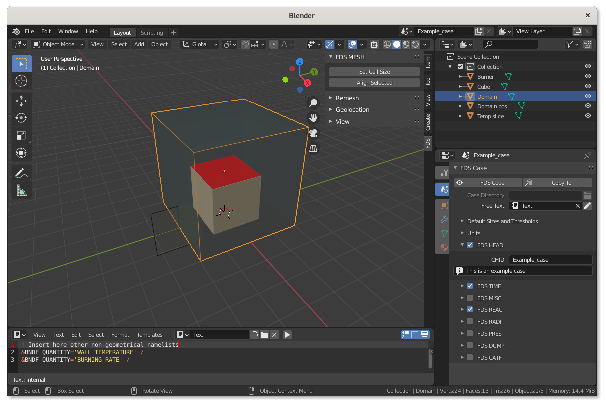

## Step 2: Explore the BlenderFDS preferences

Before going on, I am going to show you where to find the general BlenderFDS settings.

Click on the `Edit > Preferences` menu and the preferences panel opens up.

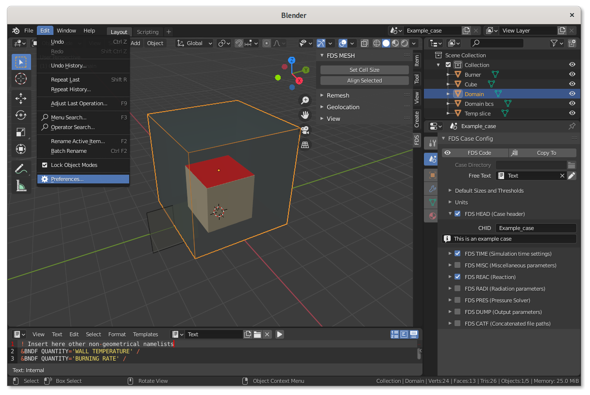

Click on the `Add-ons` tab on the left, and find the BlenderFDS addon preferences panel.

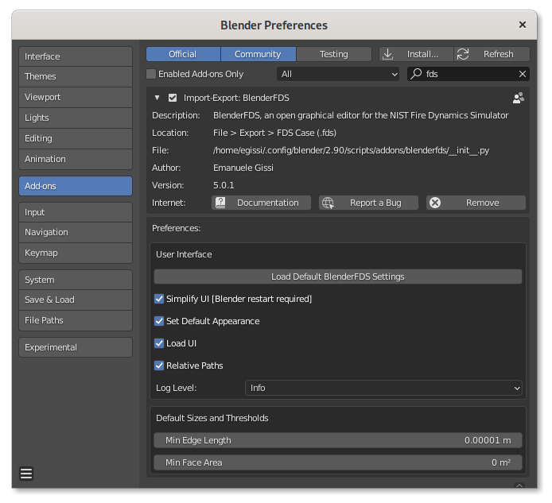

If you hover your cursor over any of the settings, an help popup appears providing an explanation.

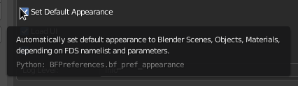

## Step 3: Explore the BlenderFDS user interface

Blender provides a number of different editors for displaying and modifying different aspects of data.
In BlenderFDS we generally use only some of them:

 * the `3D Viewport` editor,

 * the `Ouliner` tree,

 * the `Properties` panels,

 * and the `Text Editor`.

 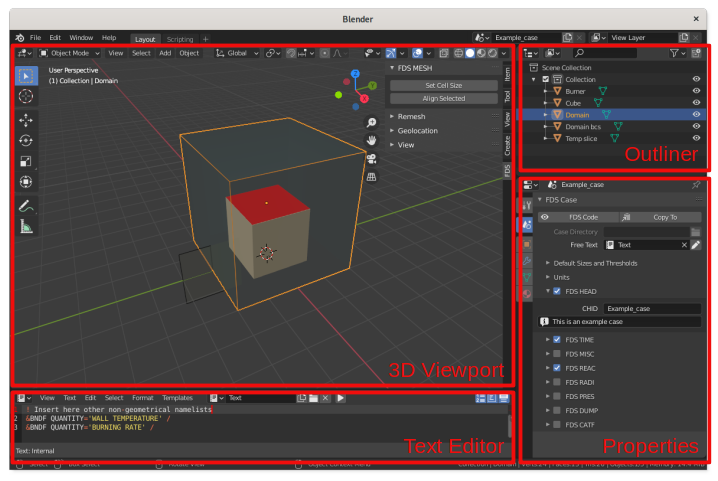

### The 3D Viewport editor

The `3D Viewport` editor is used to interact with the 3D scene for modeling.

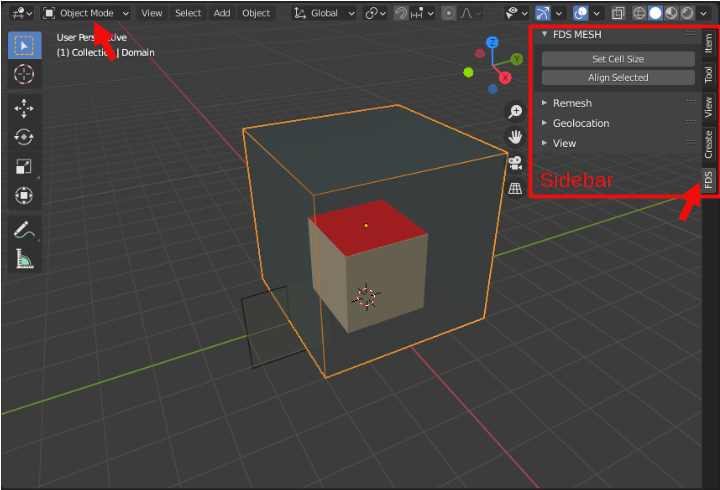

#### Editing modes

On the left-hand side of this editor, you see its several editing modes, used for editing different kinds of data.
In BlenderFDS we are going to use just two of them:

 * `Object Mode` is the default mode, and it is dedicated to object data-block editing (eg. position, rotation, size, ...).

 * `Edit Mode` is dedicated to object shape editing (eg. creating/moving/linking vertices/edges/faces). In Blender the object shape is called the `Blender Mesh`.

#### Sidebar

On the right-hand side of the `3D Viewport` you see the `Sidebar`, that has a specific tab `FDS` for BlenderFDS related activities. The sidebar panels change depending on the selected object namelist.

In the following picture, you see:
 * the sidebar panel offering some tools for a `MESH` namelist;
 * the `Remesh` panel, that collects several tools used to fix malformed geometries and make them manifold (eg. the triangulated surfaces required by the `GEOM` namelist);
 * the `Geolocation` panel, with tools that allow the precise geographic positiong of objects on the calculation domain, an useful feature when dealing with terrains in wildfire simulation cases or fire smoke pollution dispersion studies.

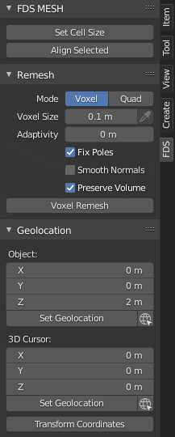

### The Outliner editor

The `Outliner` is a tree that organizes the data of the blend file: `Blender Scenes`, `Collections`, `Objects`, `Meshes`, and `Materials`. This editor is used to view, select, manage the data in the scene.

Each row in the `Outliner` shows a data-block, and what other data-blocks it contains. Data-blocks can be dragged and dropped to manage data relations. Objects can be moved to collections by dropping on the name or contents of a collection.

Collections are a way BlenderFDS uses to organize the FDS case. The exported namelists are first ordered by collection, then by `ID` parameter alphabetic order.
See [this](organize-cases) wiki page for further detail. 

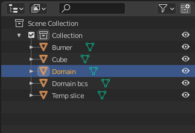

### The Properties editor

The `Properties` editor shows and allows editing of many active data properties.

This editor has several categories, which can be chosen via tabs, the icons column to its left. Each tab regroups properties and settings of a specific data type, such as `Blender Scene`, `Object`, and `Material`.

Let's explore each of them.

#### Blender Scene tab

The `Blender Scene` tab is used for the FDS case general configuration.
In these panels you can edit the parameters of many general FDS namelists: `HEAD`, `TIME`, `MISC`, `REAC`, ...

Each panel manages several of the most common parameters of the related namelist; any parameter that is not directly managed by the interface can be entered in the generic `Other Parameters` widget at the very bottom of each panel.

At the top of the tab, you find two buttons: `FDS Code` and `Copy To`. Clicking on the first button shows the FDS code that is going to be exported from the selected `Blender Scene`. The second button is used to copy the properties from a scene to another.

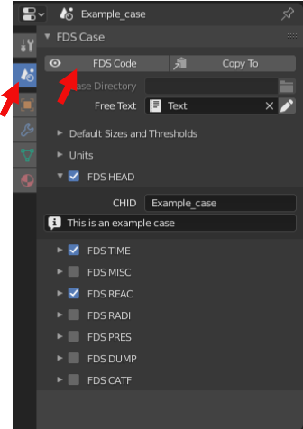

#### Blender Object tab

The `Blender Object` tab is used for adding the parameters of FDS namelist groups having any kind of geometric effect, such as `OBST`, `VENT`, `GEOM`, `SLCF`, ...

All these namelists have parameters that set their geometric properties, such as `XB`, `XYZ`, `PB`, `VERTS`, `FACES`, ...

The panel changes depending on the selected namelist, and manages several of its most common parameters; any parameter that is not directly managed by the interface can be entered in the generic `Other Parameters` widget at the very bottom of the panel.

At the top of the tab, you find three buttons: `FDS Geometry`, `FDS Code`, and `Copy To`. Clicking on the first button creates a temporary object in the `3D Viewport` that shows how the choosen geometry (eg. `XB`, `XYZ`, `PB`, ...) is going to be exported to the FDS case. Clicking on the second button shows the FDS code that is going to be exported from the selected `Blender Object`. The third button is used to copy the parameters values from the currently active object to other selected objects.

See [this wiki page](Geometries) for further details on how object geometries are exported to the FDS case.

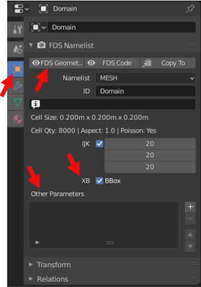

#### Blender Material tab

The `Blender Material` tab is used for editing the FDS boundary conditions in the `SURF` namelist, related to the currently selected Blender Object.

The panel manages several common `SURF` parameters; any parameter that is not directly managed by the interface can be entered in the generic `Other Parameters` widget at the very bottom of the panel.

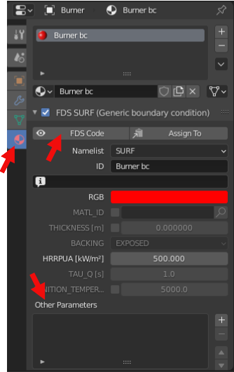

### The Text Editor

The `Text Editor` is used to create a text file, that BlenderFDS can directly attach to the exported FDS case.
This feature is used to append other non-geometrical or unmanaged namelists (eg. `MATL`, `BNDF`, ...) to the FDS case.

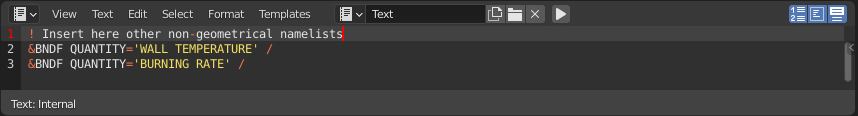

The choice of the `Free Text` file to be attached to the FDS case is specified in the `Properties` editor.

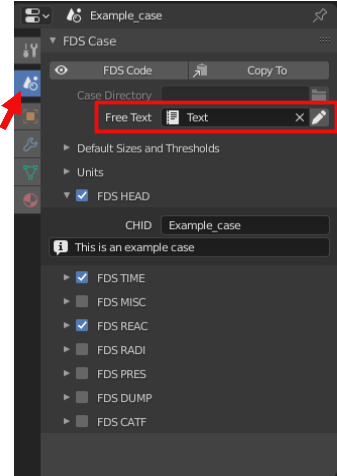

## Step 4: Save the example case

After exploring the BlenderFDS user interface, it is time to save the `.blend` file of this default example case to a local directory. Click on the `File > Save As` menu, name the file as `example.blend`, and save it on your computer.

## Step 5: Export the FDS case

Now click on the `File > Export > NIST FDS` menu, and export the FDS case you just explored to a newly created directory.

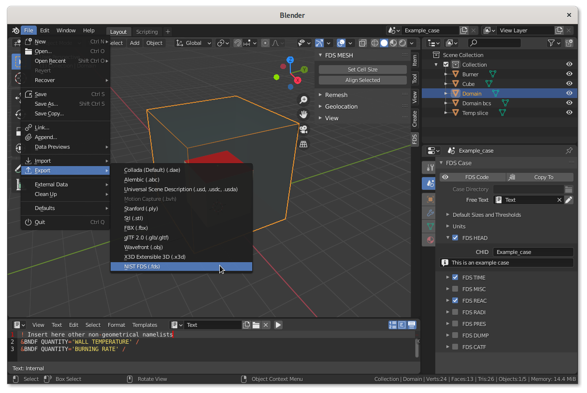

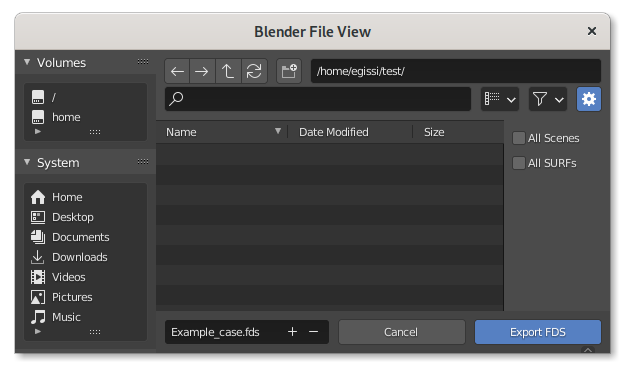

## Step 6: Look at what you have done!

The `Example_case.fds` file was exported.

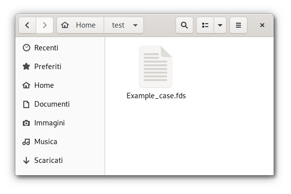

If you have a proper text editor installed on your computer, you can double click on the `Example_case.fds` file, and see what is inside.

Here I am opening the `Example_case.fds` file with the GEdit text editor on a Linux computer. Notice the nice syntax-highlighting that is provided by [GEdit](https://wiki.gnome.org/Apps/Gedit) with the [FDS extension](https://github.com/firetools/gedit-fds).

On MS Windows you can install the free and open-source [Notepad++](https://notepad-plus-plus.org/) with its [FDS extension](https://github.com/firetools/notepad-plus-plus-fds).

On macOS, you can install [Sublime Text](https://www.sublimetext.com/) and use [SublimeFDS](https://github.com/rmcdermo/SublimeFDS) for syntax highlighting.

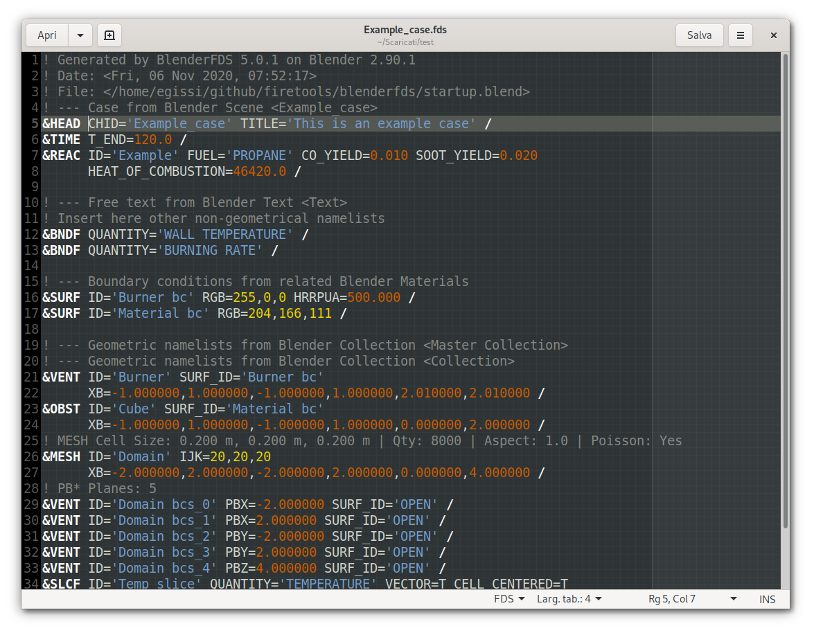

## Step 7: Run the FDS solver, and open the results

Depending on the installed operating system on your computer, there are different ways of running the FDS solver. Look at the [FDS User's Guide](https://pages.nist.gov/fds-smv/manuals.html) if you need help on that. I shall add that, if you are willing to learn how to use BlenderFDS, you should *already* be capable of running simple cases in FDS!

On Linux, I open a terminal window, move to the appropriate directory, and type `fds Example_case.fds` to run the solver on the `Example_case.fds` that was just exported from BlenderFDS.

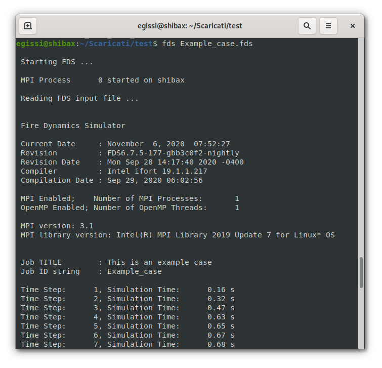

While the case is being solved, I can have a peek on what is going on by running Smokeview from another Linux terminal window.

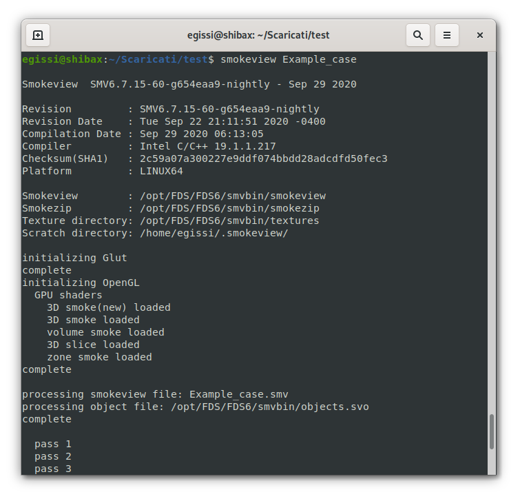

The newly opened Smokeview window displays all the wonders of the calculation we are performing.

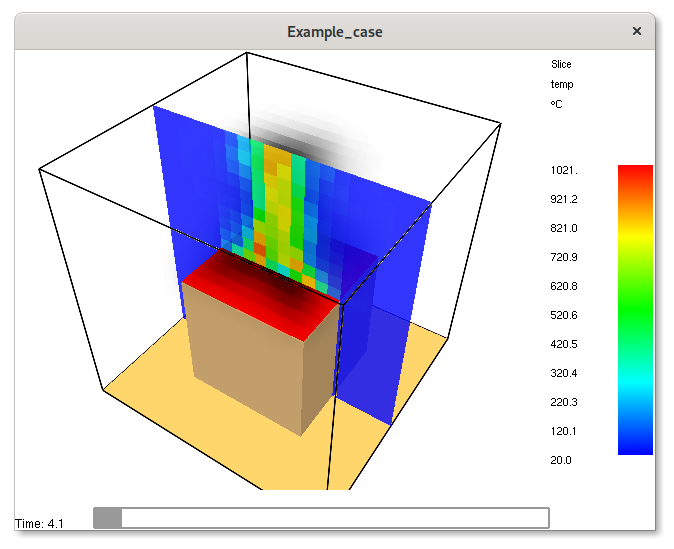

## Step 8: Go back to BlenderFDS and import an existing FDS case

While your computer is running the `Example_case.fds` you just created,
you can go back to BlenderFDS and try another useful feature.

Click on the `File > Import > NIST FDS` menu, and import any of your FDS cases. The new case is being imported into a new `Blender Scene`, as each scene of a `.blend` file refers to a different FDS case.

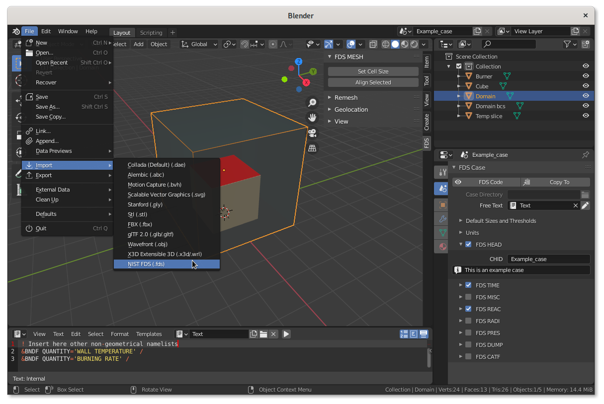

The `.blend` file can contain many scenes, and the scenes can share data-block assets (eg. `Blender Objects`, `Materials`). So you can have one only `.blend` file containing all the variations of your many FDS cases related to the same project or research.

Here I am importing the `couch.fds` case from the example files included in the official FDS package inside the `FDS/FDS6/Examples/Fires` directory.

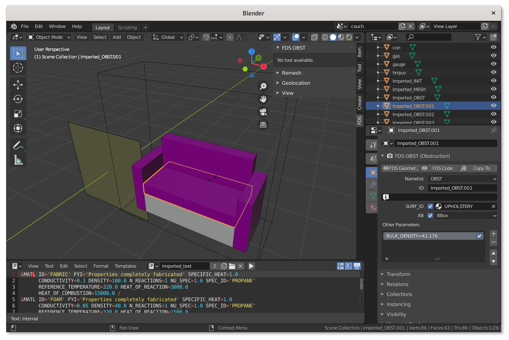

If you want to quickly, navigate between the scenes click on the pop-down menu shown in the following picture.

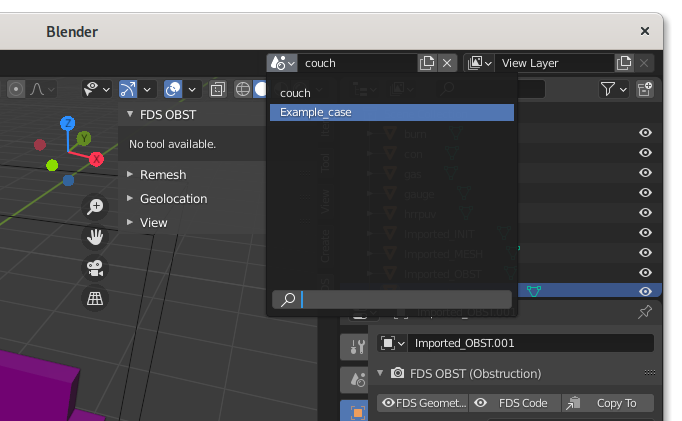

## Step 9: Relax and enjoy

After such a long journey, you are now ready to enjoy BlenderFDS, the free and open-source user interface for FDS.
Many more features are offered by its interface, described in detail by other wiki pages. 

