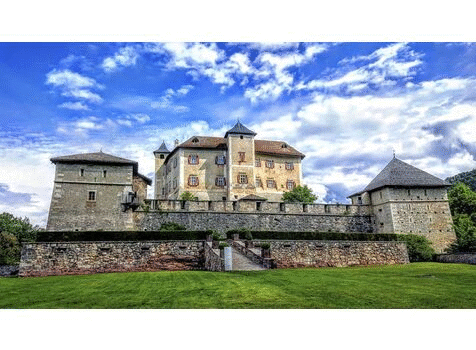

# **BlenderFDS**
{: .fs-9 }

The open user interface for the [NIST Fire Dynamics Simulator (FDS)](https://pages.nist.gov/fds-smv/)
{: .fs-6 .fw-300 }

[Get started now](docs/quickstart){: .btn .btn-primary .fs-5 .mb-4 .mb-md-0 .mr-2 } [Ask a question](https://groups.google.com/g/blenderfds){: .btn .fs-5 .mb-4 .mb-md-0 } [Submit an issue](https://github.com/firetools/blenderfds/issues){: .btn .fs-5 .mb-4 .mb-md-0 }

---

## Easy and fast

BlenderFDS helps you build complex
[NIST Fire Dynamics Simulator (FDS)](https://pages.nist.gov/fds-smv/) models *faster*,
because it eases geometric data entry with powerful 3D editing tools,
but you remain in full control over all the input parameters,
as BlenderFDS does not hide the FDS complexity and flexibility.

FDS is a large-eddy simulation (LES) code for low-speed flows,
with an emphasis on smoke and heat transport from fires.

## Open and free

BlenderFDS is developed in Python
as a free and open source [Blender](https://www.blender.org/) addon.

Blender is the free and open source 3D creation suite.
It supports the entirety of the 3D pipeline from modelling to visualisation,
and BlenderFDS makes use of its 3D modeling tools.

You can import CAD models and existing FDS input files,
and quickly adapt them to your needs.

## A family of open tools for FDS

Another companion tool is [qgis2fds](https://github.com/firetools/qgis2fds/wiki), an open [QGIS](https://www.qgis.org) plugin
that exports terrains and landuse for wildfire simulation and atmospheric dispersion of fire pollutants.
The resulting FDS file can be imported to BlenderFDS for further customization.

---

## About the project

This project is &copy; 2009-{{ "now" | date: "%Y" }} by [Emanuele Gissi](https://emanuelegissi.eu).

### License and funding

This project is free software under the terms of
the [GNU General Public License](https://www.gnu.org/licenses/gpl-3.0.en.html).
It is distributed in the hope that it will be useful,
but without any warranty.

If you prefer buying professional support, take a look at
[PyroSim](https://www.thunderheadeng.com/pyrosim)

The development of BlenderFDS was partially funded by a grant from
the [Italian Ministry of Foreign Affairs and International Cooperation](https://www.esteri.it/).

### Code of Conduct

This project is committed to fostering a welcoming community.

[View our Code of Conduct](https://github.com/firetools/blenderfds.web/tree/master/CODE_OF_CONDUCT.md) on our GitHub repository.

#### Thank you to the contributors!

<ul class="list-style-none">

  <li class="d-inline-block mr-1">
     
  </li>

</ul>
